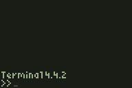

## Terminal

Featuring a command prompt user interface, this program has many useful commands and program management features. Some of the more significant functions include checking the battery status, turning TI-OS lowercase on/off, listing all the programs and appvariables on the device (including hidden files), and seeing how much storage is being used. Terminal can also be used as a full program manager, and can lock, hide, archive, run and delete programs.

## Platform

This program is built for the Texas Instruments 83+/84 graphing calculator (black and white edition).

## Download

<ul>
<li>Terminal https://github.com/scottmangiapane/ti-terminal/blob/master/terminal.8xk</li>
</ul>

## How to Install

<ul>
<li>Download TI Connect https://education.ti.com/en/us/software/search/ti-83-plus-family</li>
<li>Connect the TI-83+ or TI-84 to the computer</li>
<li>Transfer terminal.8xk to the device using TI Connect</li>
<li>Run the program from the [APPS] menu</li>
</ul>

## How To Use

<ul>
<li>[2ND] allows the user to type numbers</li>
<li>[ALPHA] allows the user to type letters</li>
<li>[ENTER] runs whatever command is typed</li>
<li>[MODE] automatically types the EXIT command</li>
<li>[CLEAR] automatically types the CLEAR command</li>
<li>[ON] automatically types the OFF command</li>
</ul>

## Command List

**Standard Commands**

<ul>
<li>"AUTO-CASE-ON" automatically runs CASE-ON whenever the terminal starts</li>
<li>"AUTO-CASE-OFF" disables AUTO-CASE</li>
<li>"BATTERY" shows the battery status as a fraction</li>
<li>"CASE-ON" allows the user to type lowercase letters throughout the operating system by pressing [ALPHA] twice</li>
<li>"CASE-OFF" disables TI-OS lowercase</li>
<li>"CLEAR" clears the screen</li>
<li>"EXIT" exits the terminal</li>
<li>"HISTORY-ON" keeps commands visible after they are executed</li>
<li>"HISTORY-OFF" hides previous commands to make the display less cluttered</li>
<li>"INFO" displays information about Terminal</li>
<li>"INVERT" will invert the display</li>
<li>"LIST-APPV" lists all the app variables found on the device (run as root to see hidden app variables)</li>
<li>"LIST-PRGM" lists programs found on the device, including hidden programs (programs that do not start with a letter or number are excluded, such as prgm! and DoorsCS folders)</li>
<li>"OFF" will put the device to sleep without exiting the terminal</li>
<li>"RAM" displays the available RAM</li>
<li>"ROM" displays the available and total storage</li>
</ul>

**PRGM Commands**
<ul>
<li>"PRGM" allows the user to select a program and enter program manager mode, enabling the following commands</li>
<li>"LOCK" locks the selected program</li>
<li>"UNLOCK" unlocks the selected program</li>
<li>"HIDE" hides the selected program</li>
<li>"UNHIDE" unhides the selected program</li>
<li>"ARCHIVE" archives the selected program</li>
<li>"UNARCHIVE" unarchives the selected program</li>
<li>"RUN" runs the selected program (assembly only)</li>
<li>"DEL" deletes the selected program</li>
<li>"EXIT" returns to the standard terminal</li>
</ul>

**Sudo Commands**
<ul>
<li>"SUDO" enables root access, giving the user access to all root commands</li>
<li>"AUTO-LOCK-ON" (root only) Makes root access required to run any commands</li>
<li>"AUTO-LOCK-OFF" (root only) Disables auto lock</li>
<li>"KILL" (root only) freezes the calculator by corrupting the archive WARNING! This command is very dangerous. It will corrupt the device's archive, which is difficult to fix without resetting the device (full reset, not a RAM clear).</li>
<li>"EXIT" returns to the standard terminal</li>
</ul>
